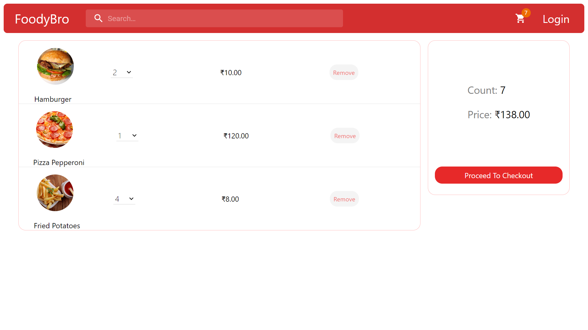
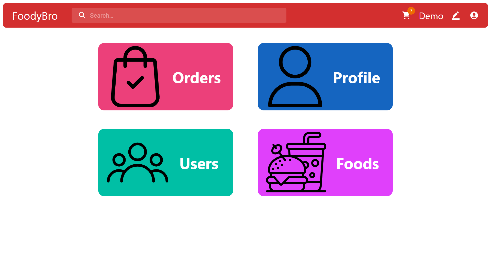

# FoodyDost - Food Ordering App

A comprehensive food ordering application built using the MERN stack. The app allows users to browse various food items, add them to the cart, proceed with checkout, and manage their profiles. It also includes an admin dashboard for managing foods and orders.

## Table of Contents

- [Food Ordering App](#food-ordering-app)
  - [Table of Contents](#table-of-contents)
  - [Features](#features)
  - [Screenshots](#screenshots)
  - [Demo](#demo)
  - [Technologies Used](#technologies-used)
    - [Frontend](#frontend)
    - [Backend](#backend)
    - [Other Tools and Services](#other-tools-and-services)
  - [Setup and Installation](#setup-and-installation)
    - [Docker setup](#docker-setup)
    - [Prerequisites for manual setup](#prerequisites)
    - [Installation](#installation)
  - [Contributing](#contributing)
  - [Contact](#contact)

## Features

- **User Authentication:** Secure registration and login.
- **Food Browsing:** Browse and view detailed information about food items.
- **Cart Management:** Add, update, or remove items in the cart.
- **Checkout Process:** Complete orders seamlessly.
- **Order Tracking:** Real-time tracking of order status.
- **Profile Management:** Update user profiles and view order history.
- **Admin Dashboard:** Manage foods, orders, and user details.
- **Food Recommendations:** Personalized food recommendations based on user searches and interests.
- **Responsive Design:** Fully responsive for both desktop and mobile devices.

## Screenshots






## Demo

Try out the live demo of the app hosted on vercel.com:

[Live Demo](https://foodydost.vercel.aoo/)

## Technologies Used

### Frontend

- **Vite:** Modern frontend build tool.
- **React:** Library for building user interfaces.
- **Axios:** HTTP client for making requests to the backend.

### Backend

- **Node.js:** JavaScript runtime for server-side development.
- **Express:** Web framework for Node.js.
- **MongoDB:** NoSQL database.

### Other Tools and Services

- **Cloudinary:** Service for image hosting and management.
- **Leaflet:** JavaScript library for interactive maps.
- **Render:** Cloud platform for deploying web apps.
- **JWT:** Secure token for user authentication.
- **Bcrypt:** Library for hashing passwords securely.

## Setup and Installation

### Docker setup

1. **Clone the repository:**
   ```bash
   git clone https://github.com/uditdev1/FoodyDost
   cd FoodyDost
2. **Run the setup script (first time only)**
    ```bash
    ./setup.sh
3. **Next time when restarting**
    ```bash
    docker compose up -d
    cd client
    npm run dev

### Prerequisites of manual setup

Ensure you have the following installed on your system:

- Node.js (https://nodejs.org/)
- MongoDB (https://www.mongodb.com/)
- A Cloudinary account (https://cloudinary.com/)

### Installation

1. **Clone the repository:**
   ```bash
   git clone https://github.com/uditdev1/FoodyDost
   cd FoodyDost

2. **Install dependencies for both frontend and backend:**
   ```bash
    # Navigate to the frontend directory
    cd client
    npm install

    # Navigate to the backend directory
    cd ../backend
    npm install

3. **Set up environment variables:**
    ```bash
    inside backend/src/ rename .env.example to .env and add all the details 

4. **Start the development servers:**
    ```bash
      # Start the backend server
      cd backend
      node src/server.js

      # In another terminal, start the frontend development server
      cd ../client
      npm run dev

## Contributing

I welcome contributions! If you have suggestions for improvements or new features, feel free to submit a pull request or open an issue.

Fork the repository
Create a new branch (git checkout -b feature-branch)
Make your changes
Commit your changes (git commit -m 'Add some feature')
Push to the branch (git push origin feature-branch)
Create a new Pull Request


## Contact
If you have any questions or need further information, feel free to contact me:

[LinkedIn](https://www.linkedin.com/in/uditdev1/)